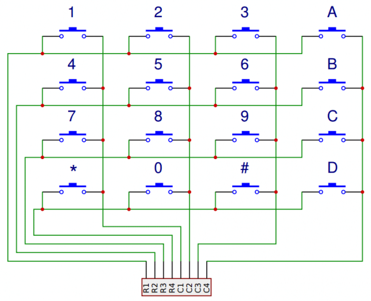

# Keyboard wiring

Each key must be somehow wired to the microcontroller, so it can determine, if a key is pressed or released.

A key is just an electric switch and by pressing a key we are making the two electrodes to connect.

The Let's Split keyboard has 24 switches on each side. If we were to wire up each key individually, we would need 24*2=48 pins (+ and - cable), which the Pro Micro simply does not have. We can optimize it by using a common group cable. This way we would not 24+1=25 pins, which is still to many.

Because of the limited pin numbers of these small microcontrollers, the keys are wired up in a matrix:

Each row and each column is connected to 1 pin. This way we need 4 (rows) + 6 (columns) = 10 pins for our keyboard to read every single key.

The way this key matrix is scanned is documented in greater detail [here](matrix_scan.md).